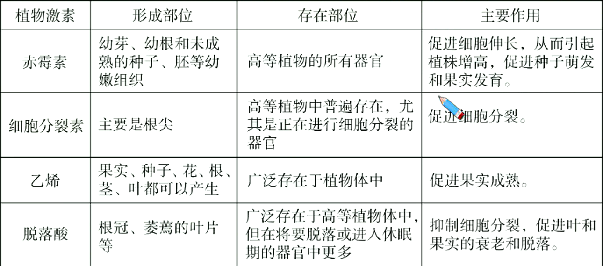
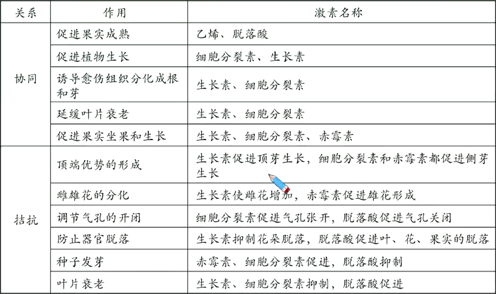

# 植物激素调节深化进阶（三)

## 其他植物激素与植物生长调节剂

### 其他植物激素

#### 其他植物激素的生理作用

除了已经介绍的5类植物激素外，植物体内还有一些天然物质也在调节生长发育过程，如油菜素（甾体类化合物）。

#### 不同植物激素的相互关系

在植物的生长发育和适应环境的过程中，各种植物激素并不是孤立地起作用，而是多种激素相互作用共同调节。不同时期由不同的激素起主导的调节作用。

例如，生长素促进植物生长主要在于促进细胞纵向伸长，随着生长素浓度的不断增高，这种促进细胞纵向伸长的功效就越强。但当生长素浓度增高到一定程度时，就会促进乙烯的合成，乙烯一方面抑制细胞纵向伸长，同时促进细胞横向扩大。在植物生长发育的不同时期，两者分别促进细胞纵向伸长和横向扩大，从而协调控制细胞的生长。

> 植物的生长发育过程，在根本上是基因组在一定时间和空间上程序性表达的结果。激素调节只是植物生命活动调节的一部分。环境因子的变化，如光照、温度等，会引起植物体内产生包括植物激素合成在内的多种变化，进而对基因组的表达进行调节。

### 植物生长调节剂的应用

1. 定义：人工合成的对植物的生长发育有调节作用的物质。
2. 优点：容易合成、原料广泛、效果稳定。
3. 应用举例
   1. 生长素类似物的应用：促进扦插枝条生根；促进果实发育；防止落花落果；作除草剂。
   2. 用乙烯利催熟凤梨。
   3. 用赤霉素处理芦苇，可增加纤维长度；用赤霉素处理大麦，使大麦种子无需发芽产生$\alpha$-淀粉酶。
   4. 青鲜素可以延长马铃薯、大蒜、洋葱等贮藏期，但其残留有可能有致癌作用。
