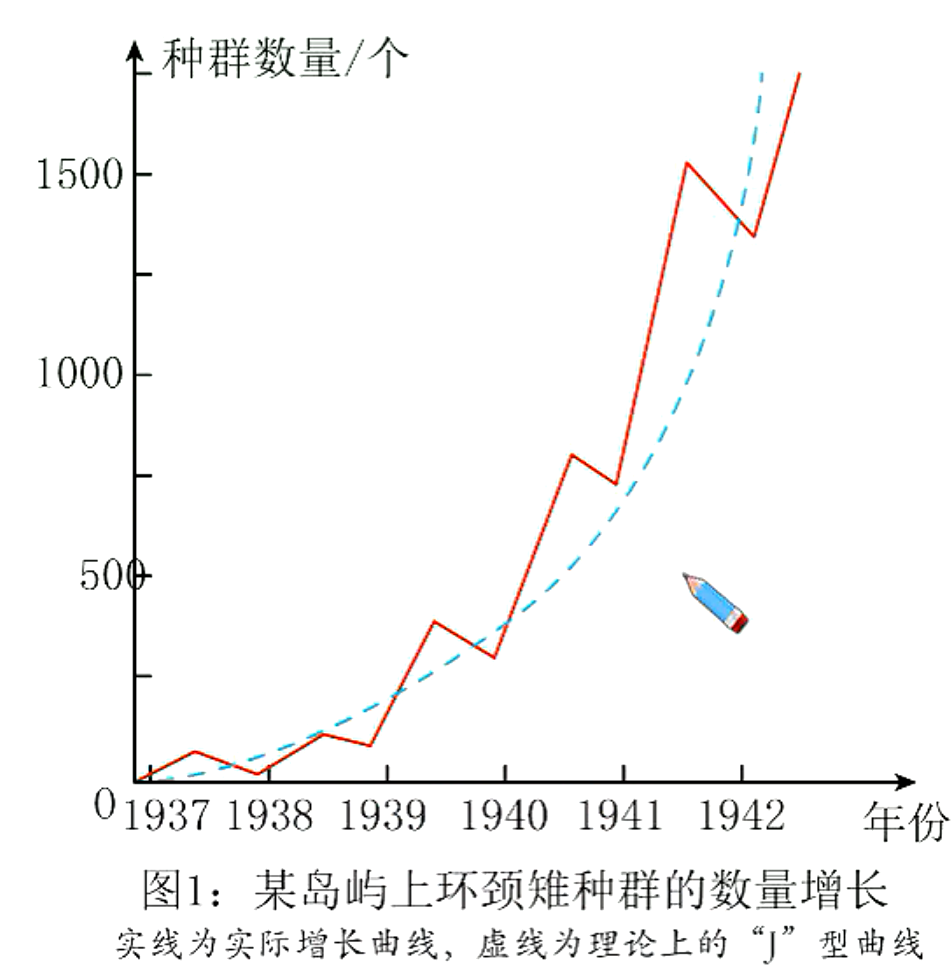
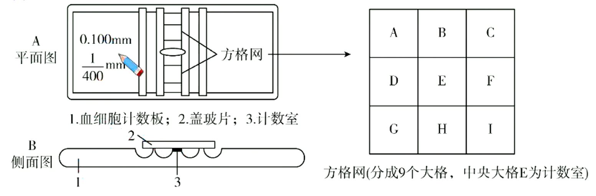
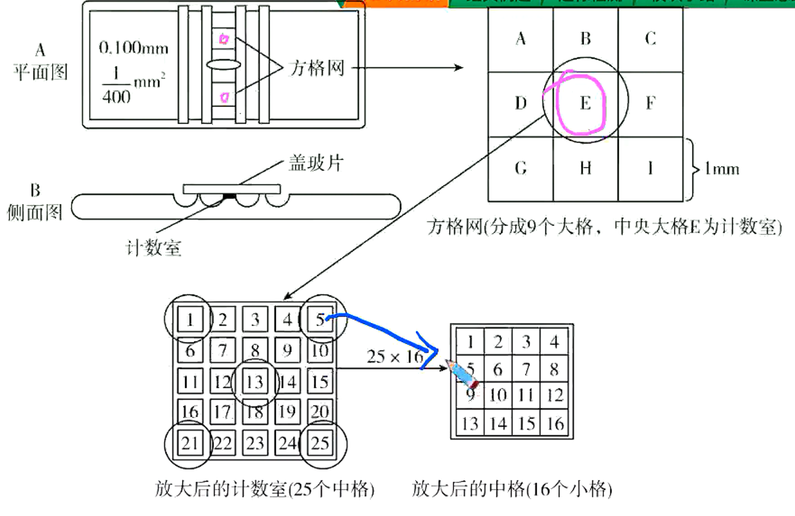
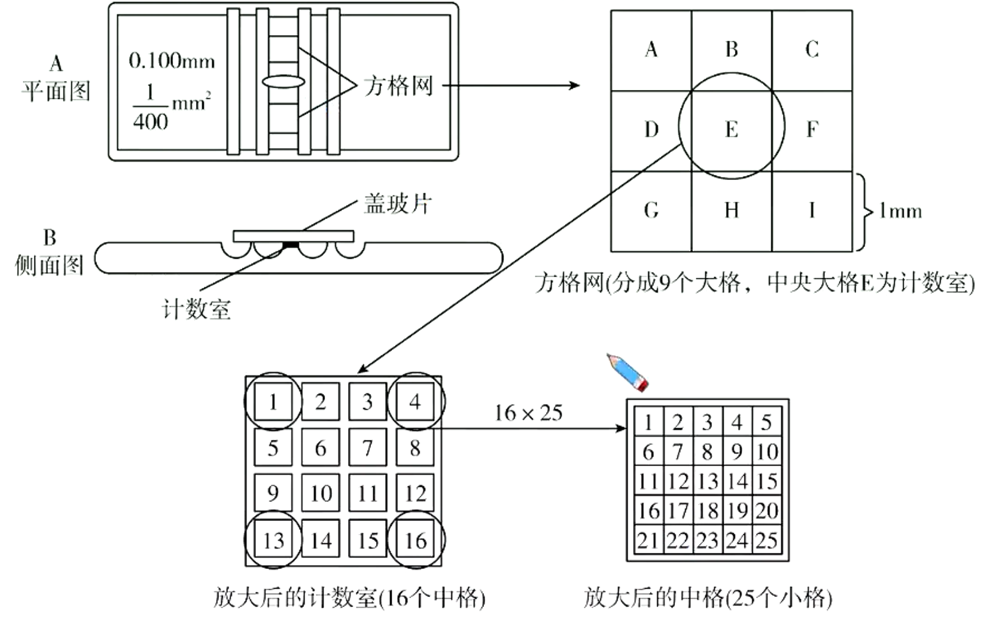
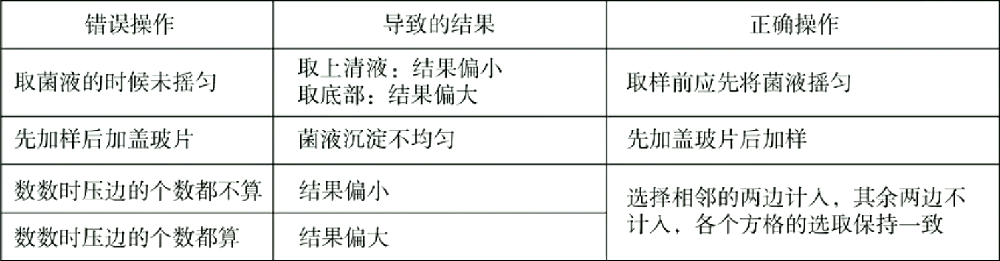
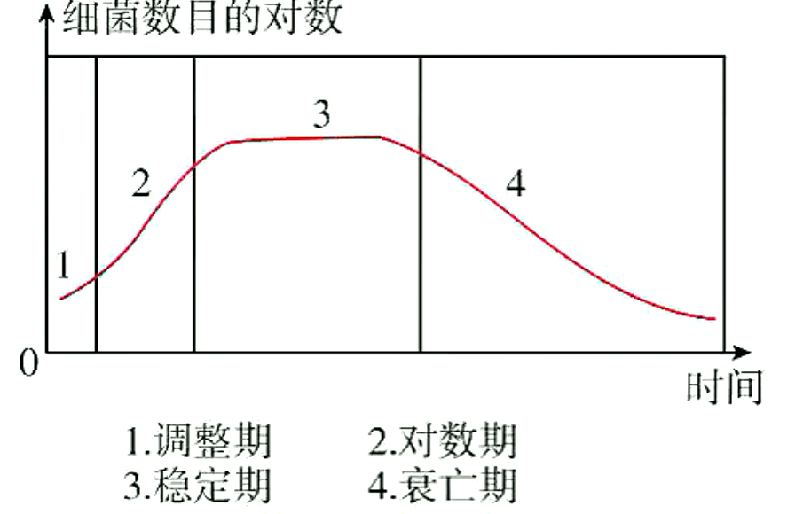
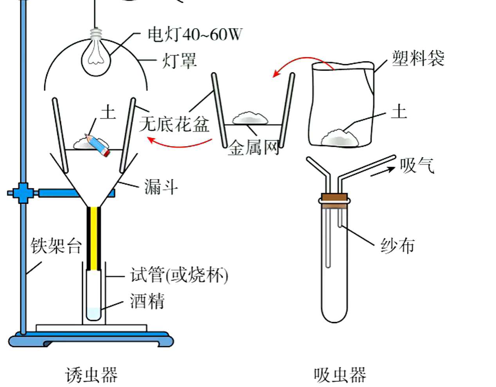

# 种群（二）

> 在自然界中，影响种群数量的因素有食物、空间、气候、天敌和传染病等。因此，大多数种群的数量总是处于波动中，在有利条件下，种群数量会增加；在不利条件下，种群数量会下降甚至消亡。种群数量的波动幅度有大有小，可以是周期性波动，也可以是非周期性波动。大多数种群数量的波动是非周期性的。

## 自然界种群数量变化

1. 自然条件下的类似“$J$”、“$S$”型增长
   自然种群数量变动中，“$J$”型增长与“$J$”型增长均可以见到，但不像数学模型所预测的光滑、典型，常常还表现为两类增长型之间的过渡型。
   自然条件下，野外种群不可能长期地、连续的增长。只有把动物引入海岛或某些新栖息地，然后研究其种群增长，才能见到类似的实例。图1是表示把两雄和六堆的环颈雉引入美国华盛顿州的一个岛以后，头五年每年春秋两季的数量调查结果（环颈雄的越冬死亡率降低了每年春季所观察到的种群数量）：
   
   澳大利亚昆虫学家曾对果园中蓟马种群进行过长达14年的研究发现，在环境条件较好的年份，其数量增加迅速，直到繁殖结束时增加突然停止，表现出“J”型增长：但在环境条件不好的年份则呈现“S”型增长。对比各年增长曲线，可以见到许多中间过渡型。
2. 种群的季节消长
   种群数量的季节消长是种群数量动态规律之一。一般具有季节性生殖的种群，其数量的最高值落在年中最后一次繁殖之末，此后种群数量下降，直到下一年繁殖开始，这时种群数量最低。许多小型鸟类和兽类、湖泊中的浮游生物，多属于季节性的数量变化。部分体型较大、一年只繁殖一次的生物种群数量也具有季节变化的特点。对这类动物的数量调查，通常一年内要进行至少两次。
3. 种群数量在不同年份的变化
   1. 不规则波动：环境的随机变化很容易造成种群不可预测的波动。大多数种群的年变化表现为不规则波动。
   2. 周期性波动：少数种群数量波动表现出明显的周期性，典型的情况是捕食者与被捕食者的制约关系导致的周期性波动。
4. 种群的爆发
   具有不规则或周期性波动的生物都有可能出现种群爆发，比如生活中常见的赤潮。赤潮是指水中的些浮游生物爆发性增殖引起水色异常的现象，主要发生在近海。它是由于氮、磷等营养物过多形成水体富营养化所致。飞蝗和鼠类也是最常见的易爆发物种。
5. 种群平衡
   大型动物等寿命长，种群数量一般较稳定。另外，一些具有良好种内调节机制的社会性昆虫种群数量也较稳定。
6. 种群的衰落和灭亡
   当种群长久处于不利条件下（人类过捕、栖息地破坏等），其种群数量会出现持久性下降，即种群衰落，甚至灭亡。个体大、出生率低、生长慢、成熟晚的生物，最易出现这种情沉。

## 研究种群数量变化规律的意义

1. 野生生物资源的合理利用与保护、濒危种群的拯救和恢复
   对于频危动植物而言，由于环境污染、人类破坏等，造成K值变小。因此通过建立自然保护区等措施提高环境容纳量，是保护这些生物的根本措施。
2. 有害生物的防治
   “$S$”型曲线中开始期（$N_0$至约$\frac{K}{2}$段），种群个体数少，数量增长缓慢，在此阶段采取防治措施效果佳。
3. 指导人工养殖及种植业中合理控制种群数量（适时捕捞、采伐）
   “$S$”型曲线中，种群数量达到$\frac{K}{2}$时，增长速率最大，资源再生能力最强。因此要保证捕捞、采伐后，种群数量不低于$\frac{K}{2}$，这样既可以获得最大利用量，又可以保持种群的高速增长，不影响资源的再生。
4. 科学控制世界人口增长，解决环境危机

## 实验：培养液中酵母菌种群数量的变化

1. 实验原理
   1. 酵母菌可以用液体培养基（培养液）培养。
   2. 培养液中酵母菌种群的增长情况与培养液中的成分、空间、pH、温度等因素有关。
2. 实验步骤
   1.将10l无菌马铃薯培养液或肉汤培养液加入试管中，将酵母菌接入试管中的培养液混合均匀。
   2. 将试管在28°C条件下连续培养。
   3. 计数：每天取样计数酵母菌数量，采用抽样检测（需要用到显微镜和血球计数板）的方法。
   4. 将所得数据用曲线图表示出来，分析实验结果，得出酵母菌种群数量变化规律。
3. 酵母菌的计数
   1. 血球计数板的使用
      
      计数板左边标明了盖玻片与计数室的距离（图中为$0.1mm$）和每个小方格的面积（图中为$\frac{1}{400}mm^2$）。一块计数板有上下两个计数室，位于方格网的中央，如上图E大方格所示。每个大方格的边长为$1mm$，则：每个大方格的菌液体积$=1mm\times1mm\times0.1mm=0.1mm^3=1×10^{-4}mL$。
      取清洁干燥的血球计数板，先加盖玻片盖住网格和两边的槽。轻轻振荡试管几次，使培养液中酵母菌分布均匀，用无菌吸管吸取培养液，滴于盖玻片边缘，让培养液自行渗入计数室内，多余的菌液用滤纸吸去。静置5-10分钟，使酵母菌细胞全部沉降到计数室底部。
      将计数板放在载物台中央，计数一个小方格内的酵母菌数量。位于分格线上的菌体，只数两条边上的，其余两边不计数。如果一个小方格内酵母菌过多，难以数清，应当适当稀释，每个小方格中菌数以5-10个为宜。
      本探究不需要设置对照实验，但需要重复实验以提高数据的准确性。
   2. 计算方法
      每个小方格的体积$=0.1mm\times1mm\times1mm\div400=\frac{1}{4000}mm^3=\frac{1}{4}×10-6mL$
      $1mL$培养液中酵母菌总数$=1$个小方格内酵母菌的平均数：
      $\frac{1}{4}\times10^{-6}mL×稀释倍数$
      若使用刻度为$25$中方格$\times16$小方格的计数板，计数四个角的4个中方格，及中央1个中方格的菌数。
      (如下图所示，方格1、5、13、21和25，共16×5=80小方格)：
      
      若使用刻度为$16$中方格$\times25$小方格的计数板，就数四个角的4个中方格（知下图所示，方格1、4、13和16.共100小方格）内的菌数。
      
      每个样品重复计数2-3次，取其平均值，按下式计算样品中的菌数。
      刻度为$25$中方格$\times16$小方格的计数板：
      每毫升菌数$=\frac{80小格内的菌数}{80}\times4\times10^6\times稀释倍数$
      刻度为16中方格×25小方格的计数板：
      每毫升菌数$=\frac{100小格内的菌数}{100}\times4\times10^6\times稀释倍数$
      注意事项：
      
4. 一定体积培养液中微生物种群数量变化曲线
   
5. 影响酵母菌种群数量的因素主要有：营养物质、代谢废物、pH、温度等。

## 群落的定义与物种组成

### 群落的定义

同一时间内聚集在一定区域中各种生物种群的集合，叫做群落。群落有一定的物种组成、一定的种间关系和一定的结构，并在环境条件相似的地段可以重复出现。组成群落的物种不是随意组合的，而是通过长期发展和自然选择保存下来的。实际上，群落就是各个物种适应环境和彼此相互适应过程的产物。

### 群落的物种组成

1. 物种组成是区分不同群落的重要特征。
   任何一个生物群落都是由一定的动物、植物和微生物种群组成。不同的物种组成构成不同的群落类型，如热带雨林的物种组成与温带落叶阔叶林的物种组成就不同。
   不同群落的物种组成的差异应该从物种种类和种群数量两个方面进行分析。
2. 丰富度
   群落中物种数目的多少称为丰富度，不同群落的丰富度不同。
3. 实验：土壤中小动物类群丰富度的研究
   1. 调查方法：取样器取样法
      许多土壤中的动物有较强的活动能力，且身体微小，不适于用样方法和标志重捕法进行调查，所以常用取样器取样的方法。即用一定规格的捕捉器（如采集罐、吸虫器等）进行取样，通过调查样本中小动物的种类和数量来推测某一区域内土壤动物的丰富度。
   2. 调查步骤
      1. 制作取样器
      2. 取样
      3. 采集小动物（如图所示装置）
         
      4. 观察和分类
      5. 统计和分析：常用记名计算法和目测估计法
         1. 记名计算法：在一定面积的样地中，直接数出各种群的个体数目。一般用于个体较大，种群数量有限的群落。
         2. 目测估计法：按预先确定的多度等级来估计单位面积上个体数量的多少。等级的划分和表示方法有“非常多、多、较多、较少、少、很少”等等。
