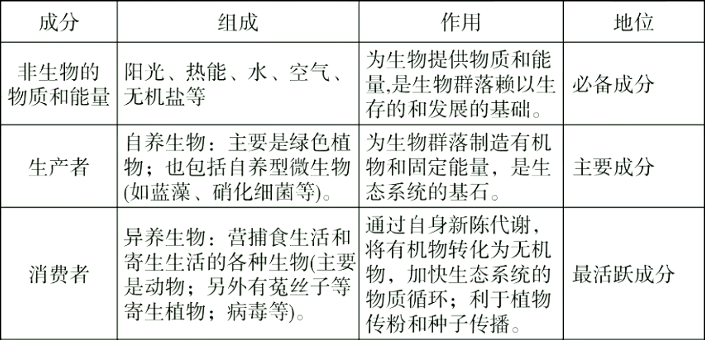
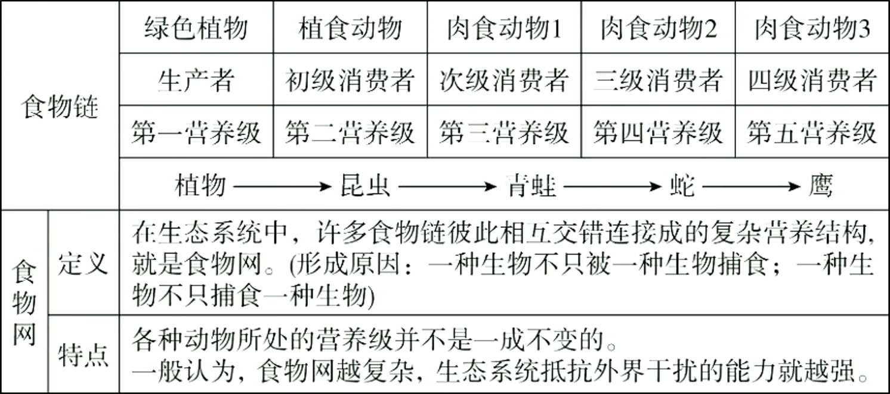
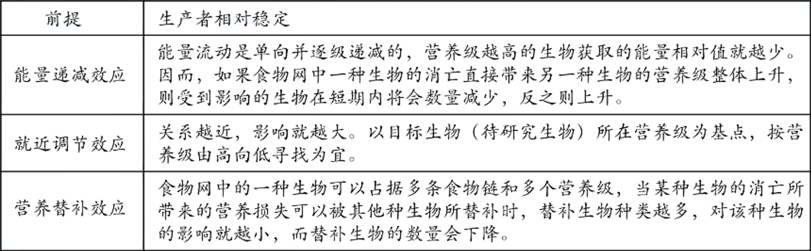

# 生态系统（一）

## 生态系统的定义与结构

### 生态系统的定义

1. 定义：由生物群落与它的无机环境相互作用而形成的统一整体，叫做生态系统。
2. 地球上最大的生态系统是生物圈。

### 生态系统的结构

#### 生态系统的组成成分

#### 生态系统的营养结构：食物链和食物网

1. 营养级的定义：食物链中的一个个环节称营养级，它是指处于食物链同一环节上所有生物的总和。
2. 捕食食物链由生产者和各级消费者组成，不包括分解者。
3. 每条食物链的起点总是生产者，止点是不被其他动物捕食的动物。
4. 同一种生物在不同的食物链中，可处于不同营养级。
5. 在食物网中，两种生物之间的关系可能不只一种，可以既有捕食关系又有竞争关系。
6. 在食物网中，当一种生物数量因某种原因而大量改变时，对另一种生物的影响沿不同的食物链结果不同，应该以中间环节最少的条链为分析依据。

> 弄清生物营养级存在状况：
> 
